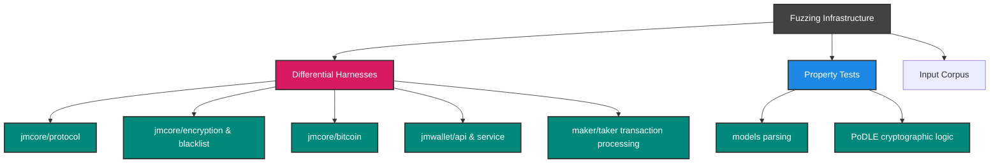

# Fuzzing JoinMarket-NG

We use [Atheris](https://github.com/google/atheris), a coverage-guided Python fuzzer based on libFuzzer.

## Fuzzing Architecture

JoinMarket-NG employs two main fuzzing paradigms:
1. **Differential Fuzzing**: Compares the NG implementation against the legacy `joinmarket-clientserver` (or other reference implementations like `python-bitcoinlib`) to find behavioral divergences.
2. **Property-based Fuzzing**: Asserts invariants within specific modules (e.g., verifying that data deserialization perfectly mirrors serialization).



## Running the Fuzzers Locally

### 1. Requirements

Ensure you have Python 3.11+ and the required modules:

```bash
pip install atheris
```

For differential fuzzing, you also need the legacy JoinMarket implementation checked out inside your system path, commonly `/tmp/joinmarket-clientserver`.

### 2. Execution

Atheris acts as both a library and an execution engine. You can run individual harnesses from the repository root:

```bash
# Set your PYTHONPATH to include the local NG components and the legacy reference
export PYTHONPATH=$(pwd)/jmcore/src:$(pwd)/jmwallet/src:$(pwd)/jmwalletd/src:$(pwd)/maker/src:$(pwd)/taker/src:/tmp/joinmarket-clientserver/src

# Run a specific harness for a set period (e.g., 60 seconds)
python3.11 fuzz/harnesses/fuzz_diff_serialization.py -max_total_time=60
```

### 3. Using the Corpus

Coverage-guided fuzzers perform best when seeded with a corpus of valid inputs. The `fuzz/corpus` directory contains seeded data for things like transactions and protocol commands.

```bash
# Feed the corpus directory to the fuzzer to maximize code coverage
python3.11 fuzz/harnesses/fuzz_tx_diff.py -max_total_time=120 fuzz/corpus/tx_parser/
```

## Creating New Harnesses

All new differential fuzzer harnesses should be added under `fuzz/harnesses/` and must adhere to the following template:

```python
import sys
import atheris

with atheris.instrument_imports():
    from jmcore.my_new_module import my_func
    # from legacy_lib import legacy_func

def TestOneInput(data):
    fdp = atheris.FuzzedDataProvider(data)
    # Extract fuzzed data: fdp.ConsumeUnicodeNoSurrogates(100), fdp.ConsumeBytes(32), etc.
    # Feed to target functions and compare behaviour.
    pass

def main():
    atheris.Setup(sys.argv, TestOneInput)
    atheris.Fuzz()

if __name__ == "__main__":
    main()
```
